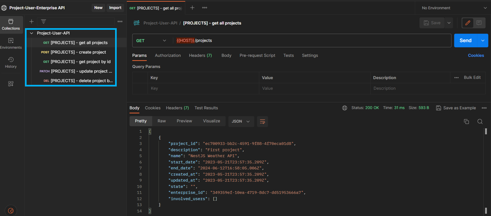
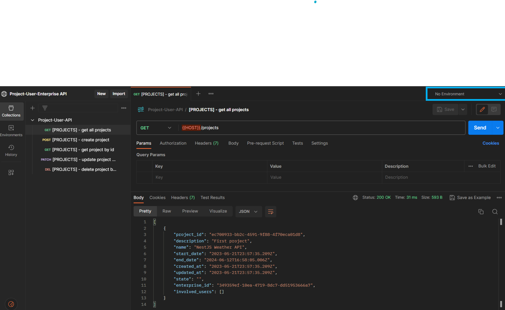
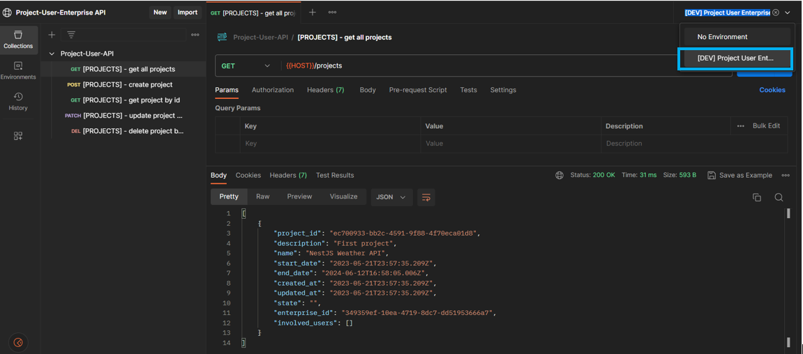
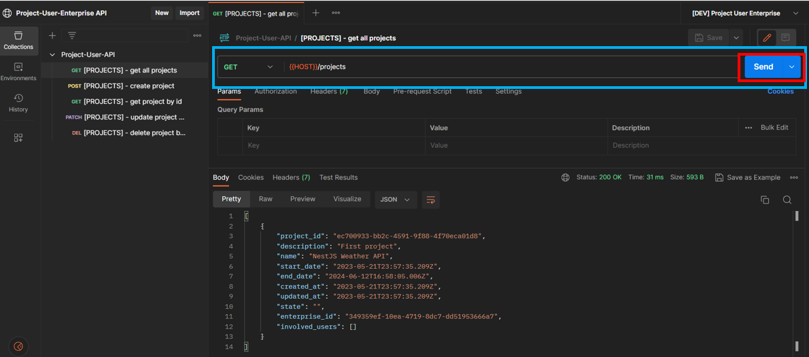
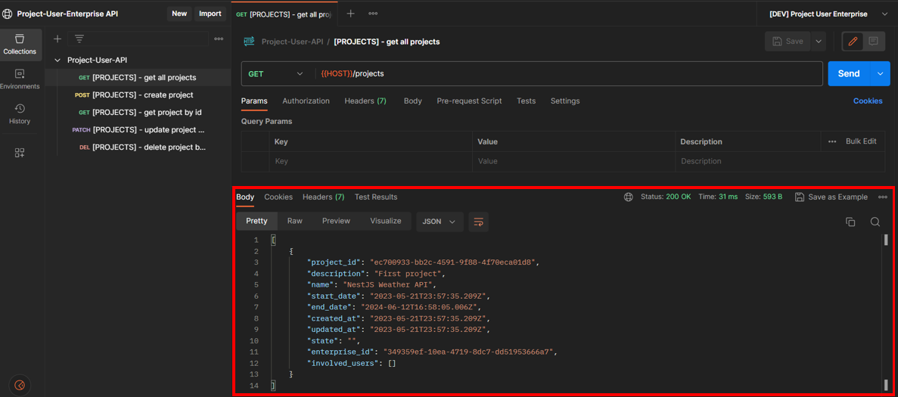

## Instrucciones de Ejecución

Esta API que permite gestionar el modelo relacional de la prueba ha sido hecha con NestJS. Para la inicialización del proyecto en Visual Studio Code después de la descarga del mismo es necesario insertar el siguiente comando: 

```bash
#Comando para abrir proyecto en VSCode
$ code Directorio_Proyecto
```

Después de inicializar el proyecto en Visual Studio Code, se accede a la terminal del mismo y se coloca el siguiente comando;

```bash
#Comando para inicializar la API 
$ nest start --watch
```

Esta API se inicializará en el puerto 3000 del servidor local de nuestro computador(El que esta por defecto). Por lo tanto para realizar las peticiones HTTP es necesario usar la siguiente dirección: http://localhost:3000. Para probar la API se dispondrá del uso de Postman Desktop o Postman Web con Postman Agent. En la siguiente dirección es posible realizar una serie peticiones estandarizadas que se realizaron al momento de probar el API: https://www.postman.com/science-observer-30781521/workspace/project-user-enterprise-api/collection/27460631-1c6ab2ac-3de0-4260-9885-04de6c7ad0bf?action=share&creator=27460631.

Cada petición en la columna izquierda:

<p align="center">
  
</p>

Representa una instrucción CRUD que tendrá una pequeña descripción en su nombre. Para própositos de agilidad, solo se realizaron peticiones sobre el módulo Projects. Antes de realizar alguna petición, es necesario establecer el ambiente de variables, ya que Postman por defecto no tiene ningún ambiente seleccionado:

<p align="center">
  
  
</p>

Para enviar la petición, solo hace falta dar al botón "Send":

<p align="center">
  
</p>

Por último la respuesta del servidor se mostrará en la sección seleccionada en la imagen:

<p align="center">
  
</p>

Las actualizaciones y consultas recibiran un JSON como respuesta. Las eliminaciones y creaciones son validadas a partir del código de "Status" que se encuentra en la sección de la respuesta del servidor en la esquina superior derecha. Los códigos de validación correcta son 200(Como en la imagen) y 201.